# **中文Embedding近年论文**

# **[Joint Learning of Character and Word Embedding](http://nlp.csai.tsinghua.edu.cn/~lzy/publications/ijcai2015_character.pdf)**

## **CWE模型**

CWE模型主要基于CBOW模型。

符号说明：$C$：中文character集合，$w$：中文词典，$\bold c_i, \bold w_i$分别表示character $c_i\in C$和word $w_i\in W$的向量表示，$K$：上下文窗口大小。

上下文词$x_j$表示为:

$$
\bold x_j = \bold w_j\oplus \frac{1}{N_j}\sum_{k=1}^{N_j}\bold c_k
$$ (1)

$\bold w_j$是$x_j$的词向量，$N_j$是$x_j$中character的数目，$\bold c_k$是第$k$个character的embedding，$\oplus$表示组合操作。$\oplus$可以是加法或者连接两者操作，但实验中发现加法更好。因此，最终$x_j$表示为：

$$
\bold x_j = \frac{1}{2}(\bold w_j + \frac{1}{N_j}\sum_{k=1}^{N_j}\bold c_k)
$$ (2)

其中乘$\frac{1}{2}$很重要，因为他保证了组合词和非组合词的一致性。具体的，在target word的negative samping和hierarchical 中softmax中不用character embedding。

## **Multiple-Prototype Character Embeddings**

中文字一般有多个意思，采用一个中文字多个向量表示的方法解决这个问题，每个向量对应一个意思。

有如下三种方法来实现：1）Position-based character embeddings；2）Cluster-based character embeddings；3）Nonparametric cluster-based character embeddings。

### **Position-based character embeddings**

一般字在词中的不同位置表示了不同的含义，因此每个字对应三个字向量$(\bold c^B, \bold c^M, \bold c^E)$，分别表示字在词的开始，中间和结尾。
因此公式（2）变为如下：

$$
\bold x_j = \frac{1}{2}(\bold w_j + \frac{1}{N_j}(\bold c_1^B+\sum_{k=2}^{N_j-1}\bold c_k^M + c_{N_j}^E))
$$ (3)

### **Cluster-based Character Embeddings**

通过将字根据它所有出现时的上下文进行聚类来形成一个字的多个意思，对于一个字$c$，聚成$N_c$个类，并且每个类训练一个向量表示。
对于一个上下文词$x_j=\{c_1,...,c_N\}$, $c_k^{r_k^{max}}$将被用来表示$\bold x_j$，定义函数$S()$为cos相似度，

$$
r_k^{max} = \arg \max_{r_k}S(\bold c_k^{r_k}, \bold v_{content})
$$ (4)
$$
\bold v_{content}=\sum_{t=j-K}^{j+K}\bold x_t=\sum_{t=j-K}^{j+K}\frac{1}{2}(\bold w_t+\frac{1}{N_j}\sum_{c_u\in x_t}\bold c_u^{most})
$$ (5)

其中$c_u^{most}$表示上一次训练中用来表示$\bold x_t$的字向量。得到所有字的最优类$R=\{r_1^{max},..., r_{Nj}^{max}\}$后，

$$
\bold x_j=\frac{1}{2}(\bold w_j+\frac{1}{N_j}\sum_{k=1}^{N_j}\bold c_k^{r_k^{max}})
$$ (6)

进一步可以把Position-based和Cluster-based结合起来，不同位置的字训练多个向量，这种被称为position-cluster-based character embeddings。

### **Nonparametric Cluster-based Character Embeddings**

上面介绍的方法需要手动定类的数目，因此提出一种方法能够自动定每个字的类的数目。

$N_{c_k}$是字$c_k$的类的数目，对于词$x_j$中的字$c_k$，他所属的类$r_k$如下确定：

$$
r_k = \begin{cases}
        N_{c_k} + 1, & if\ S(c_k^{r_k}, \bold v_{content}) \lt \lambda\ for\ all\ r_k.\\
        r_k^{max}, & otherwise
    \end{cases}
$$ (7)

## **训练的词的选择**

有许多字并没有在意思上是字的组合，例如1）single-morpheme multi-character words，琵琶，徘徊等，这些词中的字很少在其他词中出现；2）音译词，沙发（sofa），巧克力（chocolate）等，它们主要是音的组合；3）许多实体词，比如人名，地名和机构名。

为了防止用上述方法来推断非组合词，手动建立了一个音译词的词表，并且通过词性标注来识别出实体词，single-morpheme multi-character words对于模型影响很小，因为它们的字一般只在这些词中出现，所以不做特殊处理。

## **数据集和实验设置**

选择人民日报作为训练语料。向量维度200，上下文窗口5，同时用hierarchical softmax和10个词的negative sampling。进行上述的选词操作，使用预训练的字向量。CBOW,Skip-gram和GloVe作为baseline，使用同样的向量维度和默认参数设置。主要通过词相似和词analogy做评价。

## **词相似**

利用wordsim-240和wordsim-296作为评测数据集，其中240中有7对word是oov的，296中有16对word是oov的。

计算预测得分和人工得分的Spearman correlation来进行比较。得分通过计算两个词的cos相似度得到。

CWE中词向量根据公式（1）得到，对于包含oov的词对，baseline方法将其相似度设为0，CWE模型通过它们的字向量得到embedding。

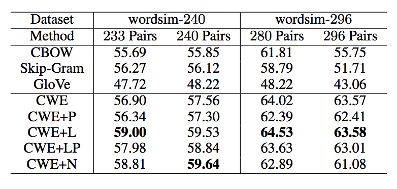

1）CWE及其变体效果好于baseline；2）cluster-based（+L,+LP和+N）好于CWE，表明一个字对应多个向量很重要，而位置信息（+P）则不是很重要；3）对于wordsim-240,oov并没有明显影响效果，可能这些词对本身就关系不大。4）对于wordsim-296，oov明显影响baseline效果，但不影响CWE。比如“老虎”和“美洲虎”，baseline设为0明显太低了，而CWE根据character得到更好的结果。5）但是添加字向量有时也会带来副作用，因为CWE可能会因为两个词共有某些字而误判它们的相似度，比如“肥皂剧”和“歌剧”，“电话”和“回话”等。

## **词analogy**

建立了包含1126对analogies的中文数据库，共有三类：1）国家和首都（687组）；2）州／省和城市（175组）；3）家庭相关的词（240组）

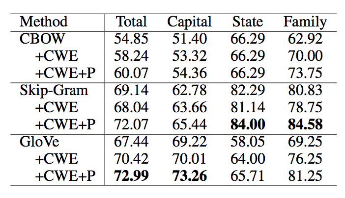

1）大多数情况添加了CWE的版本好于原始版本，说明字向量的重要性；2）CWE同样能提高非组合词的效果，比如国家首都中，基本都是实体词，CWE的版本同样更好；3）正如之前文章所述，Skip-gram和GloVe在analogy上比CBOW好

## **语料大小的影响**

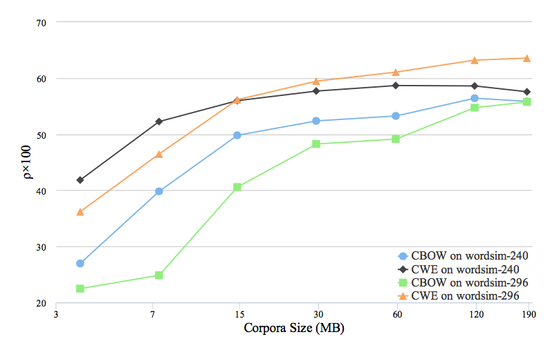

在语料小的时候，CWE比CBOW效果更好。

## **Case Study**

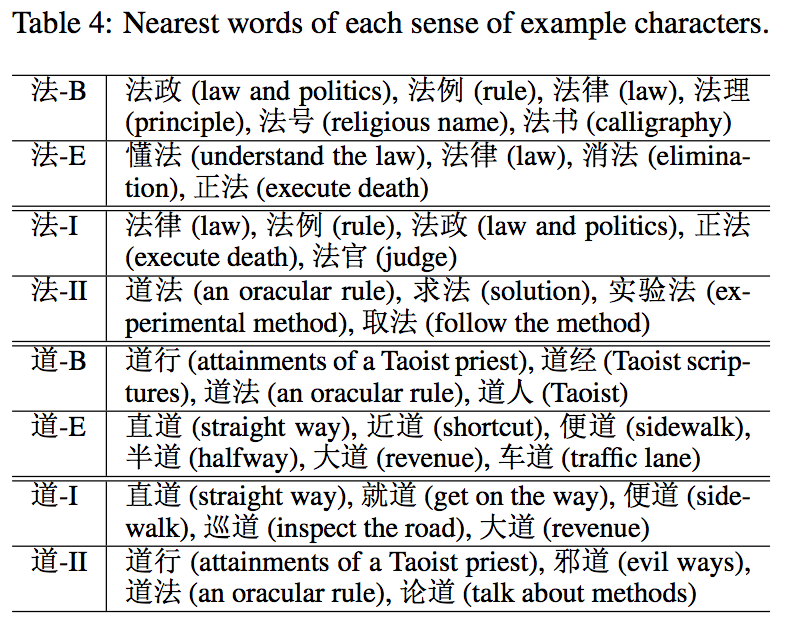

上图结果来自CWE+P和CWE+L，其中cluster数目为2。对于每个字，我们列出和它cos相似度最大的词。$x_j$使用公式（4）作为词向量。

大多数情况下，CWE+P和CWE+L都能很好区分出字的不同意思，但CWE+L更加鲁棒，基本都很好。

## ***代码地址***

https://github.com/Leonard-Xu/CWE

#

# **[Component-Enhanced Chinese Character Embeddings](https://arxiv.org/pdf/1508.06669.pdf)**

## **Component-Enhanced Character Embeddings**

该方法主要针对训练字向量。

中文字中偏旁部首一般包含了丰富的语义信息，可以用来训练更加好的词向量。手工建立了所有中文字的component list，偏旁部首作为最重要的组件。

符号介绍：$D=\{z_1,...,z_N\}$表示在字表$V$上的包含$N$个字的语料。$z$表示中文字，$c$表示上下文字，$e$表示component list，$K$表示向量维度，$T$表示上下文窗口大小，$M$表示每个字考虑的组件个数，$|V|$表示字表的大小。

开发了两种component-enhanced character embedding模型，charCBOW和charSkpGram，分别基于CBOW和SkipGram。

比如charCBOW根据上下文窗口中的字和相应组件来预测当前字，最大化如下log likelihood：

$$
L = \sum_{z_i^n\in D}\log p(z_i|h_i),
$$
$$
h_i = concatenation(c_{i-T},e_{i-T},...,c_{i+T},e_{i+T})
$$

## **评价方法**

通过词相似和文本分类作为评测任务。用[哈工大信息检索研究中心同义词词林扩展版](http://ir.hit.edu.cn/demo/ltp/Sharing_Plan.htm)作为词相似数据集，[腾讯新闻](http://www.datatang.com/data/44341)(好像失效了)标题作为文本分类数据集。

偏旁部首通过[在线新华字典](http://xh.5156edu.com) 提取，其余组件通过在新华字典中匹配“从（from）+ X”的模式提取，表示该字含有X这个组件。通过在[Hong Kong Computer Chinese Basic Component Reference](https://www.ogcio.gov.hk/tc/our_work/business/tech_promotion/ccli/cliac/glyphs_guidelines.html) 中匹配“X is only seen”模式来扩充component list。每个字最多取两个组件来构建字向量。

使用[中文维基](http://download.wikipedia.com/zhwiki/) 作为训练语料。预处理时，去处纯数字和非中文字符，并且忽视出现次数少于10的词。设置上下文窗口为2，取5个negative sampling，向量维度取50。

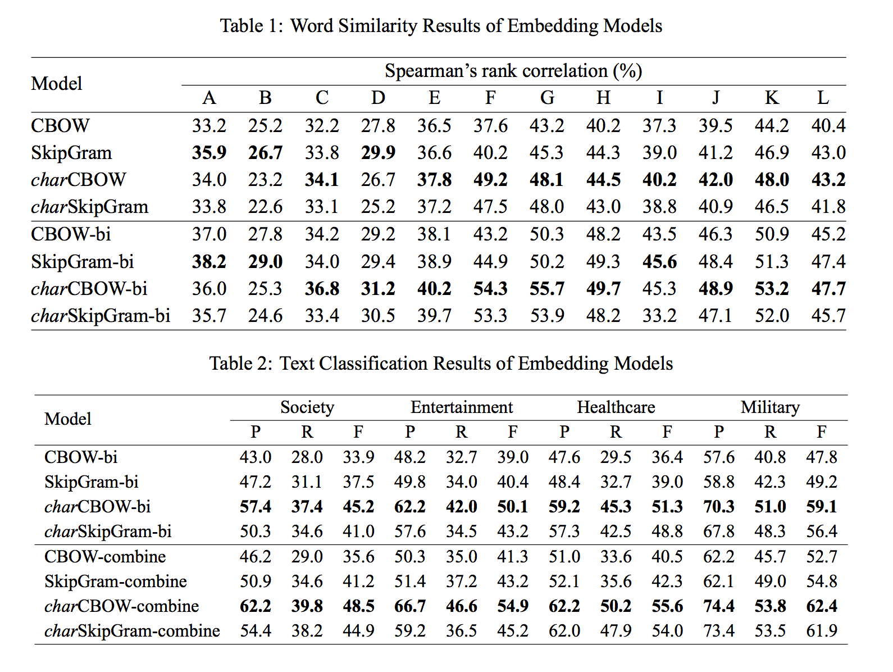

词相似用Spearman’s rank correlation作为评价标准。文本分类用标题中字向量的平均作为分类器的输入。和原文描述一致，CBOW比SkipGram差。总的来说char-*模型更好。

#

# **[Improve Chinese Word Embeddings by Exploiting Internal Structure](http://www.aclweb.org/anthology/N16-1119)**

## **SCWE模型**

主要受CWE模型启发，通过多语言的方法计算一个词中每个字对于语义的贡献。

## **Obtain translations of Chinese words and characters**

对中文训练语料进行分词和词性标注，其中实体词作为非组合词，计数字在词中出现的次数，其中有些词由很少在其他词中出现的字组成，它们被当作single-morpheme multi-character words，作为非组合词。

通过在线翻译工具将中文词和字翻译成英文，对于非组合词，它们不用翻译。

## **Perform Chinese character sense disambiguation**

首先用CBOW在英文语料上训练英文词向量。

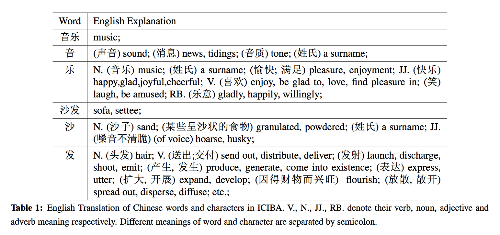

如上图，“乐”字有些意思间差别很小，它们只是词性不同。中文字有些词性不同但是表达了相同的意思，因此它们被合为一个语义意思。用$Sim()$函数衡量中文词和字之间的相似度，这里使用cos距离。中文字$c$的第$i$和$j$个意思分别为$c^i$和$c^j$。它们的相似度定义如下：

$$
Sim(c^i, c^j)=\max(\cos(v_{x_m},v_{x_n}))
$$ 
$$
s.t.\ x_m\in Trans(c^i),x_n\in Trans(c^j),x_m,x_n\notin stop\_words(en)
$$ (1)

其中$Trans(c^i)$表示$c^i$的英文翻译,$stop\_words(en)$表示英文中的停止词。比如上图中的词“音乐”，$c_2$表示第二个字“乐”，$Trans(c_2^3)$表示“乐”的第三种翻译，即{pleasure, enjoyment}，因此$x_m$可以是pleasure或者enjoyment。

如果$Sim(c^i,c^j)$大于阈值$\delta$，他们将被合并为一个语义。简单点，我们合并相应英文翻译的词集。我们也可以对于所有$x_m$词向量求平均来表示相似度，但是实验中取最大值效果更好。

中文中组合词的意思和其中某个字的意思会很接近，而音译词词的意思和每个字都不同，比如组合词“音乐”和音译词“沙发”。因此，如果$\max(Sim(x_t,c_k))\gt \lambda, c_k\in x_t$，那么$x_t$将被视为组合词，被纳入COMP集合中。这样对于组合词，我们有这样的集合

$$
F=\{(x_t,s_t,n_t)|x_t\in COMP\}
$$ (2)

其中

$$
s_t=\{Sim(x_t,c_k)|c_k\in x_t\}
$$
$$
n_t=\{\max_i Sim(x_t,c_k^i)|c_k\in x_t\}
$$ (3)

比如“音乐”定义为("音乐"，{Sim("音乐"，“音”)，Sim("音乐"，“乐”)}，{1，1})

## **Learn word and character vectors with SCWE**

对于词$x_t$，在SCWE模型中

$$
\hat{v}_{x_t}=\frac{1}{2}\{v_{x_t}+\frac{1}{N_t}\sum_{k=1}^{N_t}Sim(x_t,c_k)v_{c_k}\}
$$ (4)

提出multiple-prototype character embeddings，称为SCWE+M模型利用F集合中每个元素最后一个属性来给不同意思的字分配不同的字向量，这样在SCWE+M中

$$
\hat{v}_{x_t}=\frac{1}{2}\{v_{x_t}+\frac{1}{N_t}\sum_{k=1}^{N_t}Sim(x_t,c_k)v_{c_k^i}\}
$$ (5)

## **实验设置**

利用[英文维基](http://download.wikipedia.com/enwiki/) 训练CBOW的英文词向量，用[中文维基](http://download.wikipedia.com/zhwiki/) 作为语料,把纯数字和非中文字符去掉，用[ANSJ](https://github.com/NLPchina/ansj_seg) 做分词，词性标注和命名体识别。用[ICIBA](http://www.iciba.com/) 作为英中翻译工具。上下文窗口大小为5，词／字向量维度为100，阈值$\delta$和$\lambda$设为0.5和0.4。

## **词相似**

wordsim-240和wordsim-296(Semeval-2012 task 4: evaluating chinese word similarity)作为数据集，Spearman’s rank correlation作为评价方法。

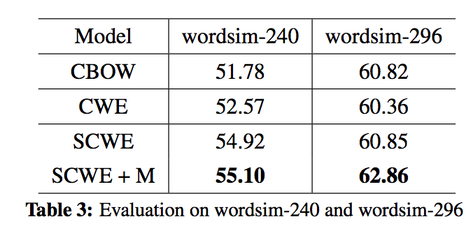

SCWE和SCWE+M更好，而且在wordsim-296上SCWE和baseline差不多，但是SCWE+M更好，表示multiple-prototype是有用的。

## **文本分类**

用[复旦语料](http://www.datatang.com/data/44139)作为数据集。为了防止不平衡，选取十个类别，分为两大组。一组为Fudan-large，每个类别下文章数多于1000，另一组为Fudan-small，每个类别下文章数小于100。每个类别80%用作训练，剩下的用来测试。

同样把纯数字和中文字符去掉，然后用ANSJ做处理。每篇文章的出版信息被删掉。通过对文章中词的词向量求平均来表示这篇文章，然后用LIBLINEAR训练分类器。

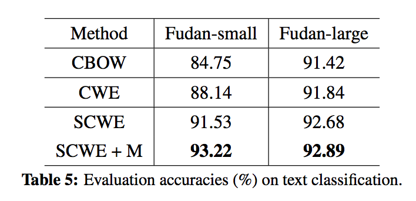

SCWE更好。

## **Multiple Prototype of Chinese Charaters**

通过PCA可视化词／字向量，然后取“道”和“光”的三个意思和每个意思最接近的词。

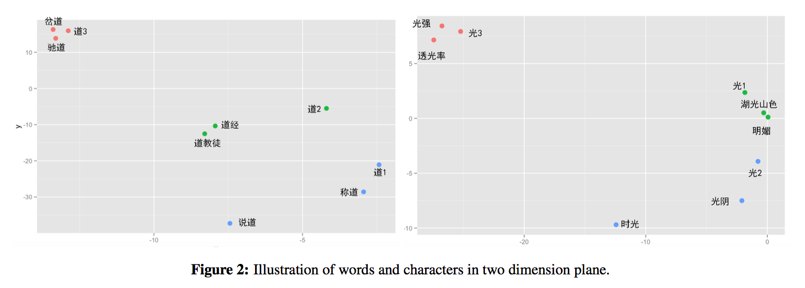

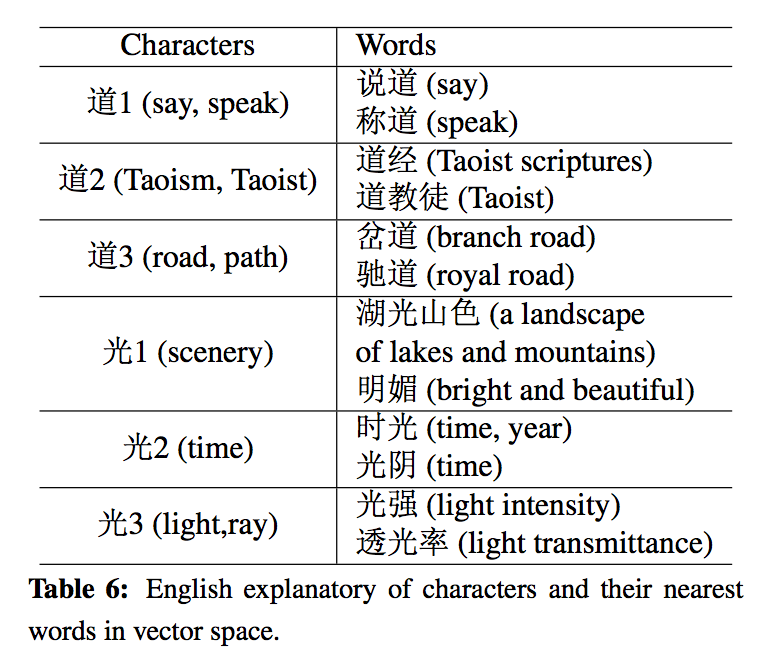

选一些多义的字，用[在线新华字典](http://xh.5156edu.com/) 作为区分词中多义字的标准答案。每个词根据词典中的解释有一个序号，然后我们用KNN分类起来验证所有方法。结果如下

SCWE最好

## **词向量的定量分析**

取两个词作为例子，列出它们最近的词，分析CWE和SCWE。

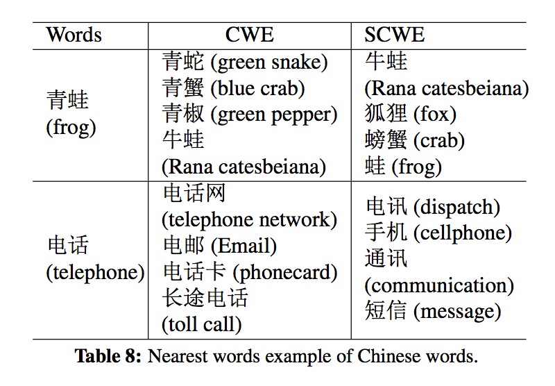

大多数情况CWE和SCWE返回的词都是一样的。但是CWE中每个字贡献一样，就会导致例如“青蛙”中，有“青”字的会被认为相似，而SCWE不会这样。

## **参数分析**

探讨参数组合词相似阈值$\lambda$和字义区分阈值$\delta$的取值。
构建了一个音译词词表，用来评测$\lambda$的取值。

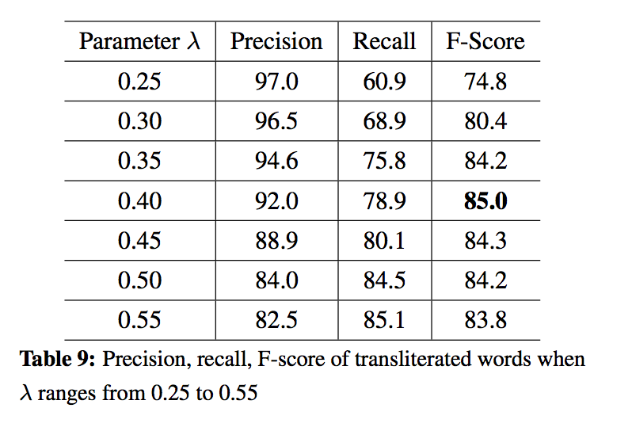

$\lambda=0.4$最好

利用Multiple Prototype of Chinese Charaters中的数据集，在不同$\delta$下算多义字区分的准确率。

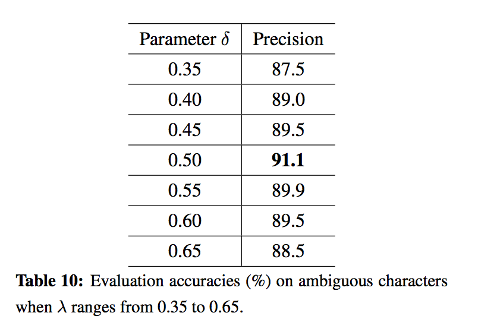

$\delta=0.5$最好

## **代码链接**

https://github.com/JianXu123/SCWE

#

# **[Multi-Granularity Chinese Word Embedding](https://www.aclweb.org/anthology/D16-1100)**

## **Multi-Granularity Word Embedding(MGE)模型**

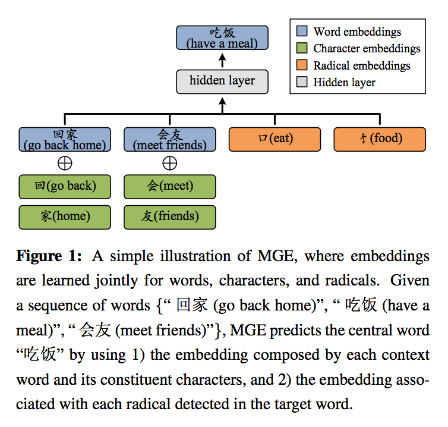

MGE模型主要基于CBOW和CWE。

符号介绍：$W$：中文词表，$C$:中文字表，$R$：中文偏旁部首表，对于每个$w_i\in W, c_i\in C, r_i\in R$，他们的向量表示分别为$\bold w_i, \bold c_i, \bold r_i$, 词$w_i$上下文窗口中的词集合为$W_i$，词$w_j$组成字的集合为$C_j$，词$w_i$的偏旁部首集合为$R_i$。在语料$D$上，MGE最大化如下log likelihood，

$$
L(D)=\sum_{w_i\in D}\log p(\bold w_i|\bold h_i)
$$ (1)

其中$\bold h_i$定义如下：

$$
\bold h_i = \frac{1}{2}[\frac{1}{|W_i|}\sum_{w_j\in W_i}(\bold w_j \oplus\frac{1}{|C_j|}\sum_{c_k\in C_j}\bold c_k)+\frac{1}{|R_i|}\sum_{r_k\in R_i}\bold r_k]
$$ (2)

$\oplus$可以是加法或者连接，这里用加法。最后条件概率$p(\bold w_i|\bold h_i)$由softmax函数算出来

$$
p(\bold w_i|\bold h_i)=\frac{\exp(\bold h_i^T\bold w_i)}{\sum_{w_{i'}\in W}\exp(\bold h_i^T\bold w_{i'})}
$$ (3)

不是所有中文词都是组合的，比如音译词和实体词，这些词不用character和偏旁部首信息。和CWE一样，同样考虑字的位置信息，模型为MGE+P。

## **实验设置**

用[中文维基](http://download.wikipedia.com/zhwiki) 作为训练语料，用[THULAC](http://thulac.thunlp.org/)工具来分词，词性标注和实体识别。纯数字，非中文字和词频小于5的被去除。然后爬取[中文字典](http://zd.diyifanwen.com/zidian/bs/) 构建字-部首表，包含20847个字和269个偏旁部首，利用这个表来检测语料中每个字的部首。上下文窗口设为3，向量维度取{100, 200}，使用10个词的negative sampling，定初始学习率为0.025。

## **词相似**

用CWE的WordSim-240和WordSim-296作为数据集，其中240中有一对是oov，296中有3对是oov，所以实际是WordSim-239,WordSim-293。同样使用Spearman correlation作为评价标准。相似度用cos距离衡量

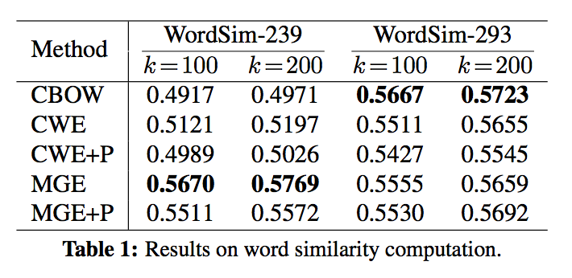

1）在WordSim-239上，MGE+P比CWE+P好，并且好于CBOW，例如，MGE会因为“银行”和“钱”都有钱字部首而认为相似。2）在WordSim-293上，MGE+P比CWE+P好，但都差于CBOW，可能因为这个数据集有很多相似度很低的词，而用字或者部首不能很好的区分它们（这个观察和CWE原文中CWE好于CBOW不符合，可能是两个对于组合词的提取方法不同导致的）。

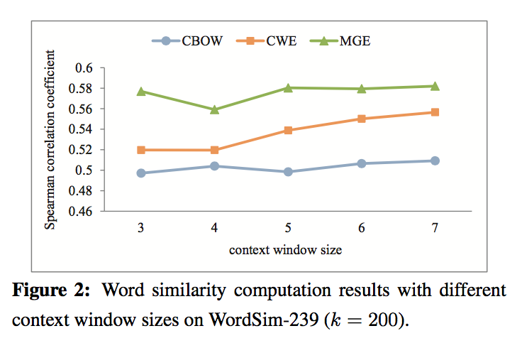

可以看出随着上下文窗口大小变化，MGE都是最好的。

## **词Analogy**

使用CWE提供的数据集做测试。

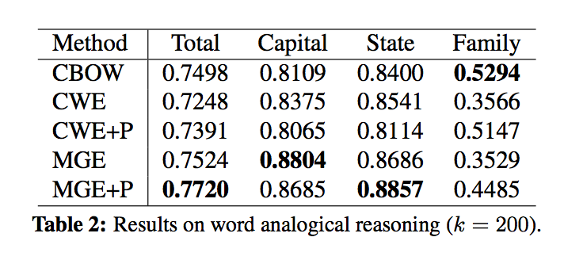

1）MGE+P总提示最好的；2）对于首都和州的类别，MGE也是最好的，说明对于非组合词，MGE也起作用。3）家庭类，差于CBOW，有可能是把这些词错误的分成了字，比如“叔叔(uncle):阿姨(aunt) = 王子(prince) : ? ”，如果把“王子”分成两个字做处理，那么结果更可能得到“女王”而不是“公主”，因为女王可以分为“女”和“王”，“女“相对于”子“。

## **Case Study**

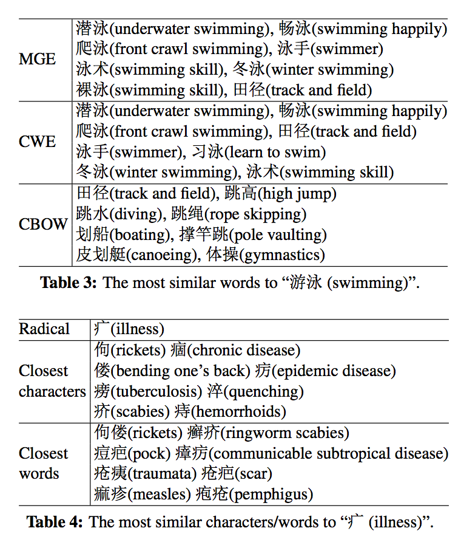

对所有模型取和“游泳”最接近的词，1）由于考虑了字，CWE和MGE都是最相近的词为“潜泳”，而CBOW最接近的为“田径”。2）MGE比CWE好，因为考虑了偏旁部首，由于三点水部首。

考虑和病字头部首最接近的字和词，基本都是和疾病相关的，看出由于把词，字和偏旁部首在同一个向量空间表示，它们会具备一些相似性。

#

# **[Joint Embeddings of Chinese Words, Characters, and Fine-grained Subcharacter Components](http://www.cse.ust.hk/~yqsong/papers/2017-EMNLP-ChineseEmbedding.pdf)**

## **JWE模型**

考虑更多部首外字以下的组件。比如“照”字不仅有火字底，还包含"日"“刀”“口”等其他组件。

$D$表示训练语料，$W=(w_1,...,w_N)$是词表，$C=(c_1,...c_M)$是字表，$S=(s_1,...,s_K)$是组件表，T是上下文窗口大小。JWE分别用词向量，字向量和组件向量的平均来预测当前词，并且把这三者的和作为目标函数

$$
L(w_i)=\sum_{k=1}^{3}\log P(w_i|h_{i_k})
$$ (1)

$h_{i_1},h_{i_2},h_{i_3}$分别表示上下文词，字和组件。令$\bold v_{w_i}, \bold v_{c_i}, \bold v_{s_i}$表示词，字和组件的"input"向量表示，$\hat \bold v_{w_i}$表示词的"output"向量表示。条件概率定义如下

$$
p(w_i|h_{i_k})=\frac{\exp(\bold h_{i_k}^T \hat \bold v_{w_i})}{\sum_{j=1}^{N}\exp(\bold h_{i_k}^T \hat \bold v_{w_j})},\ k=1,2,3
$$ (2)

$\bold h_{i_1}$表示上下文词"input"表示的平均

$$
\bold h_{i_1}=\frac{1}{2T}\sum_{-T\le j\le T,j\ne 0}\bold v_{w_{i+j}}
$$ (3)

同样的，$\bold h_{i_2},\bold h_{i_3}$分别表示上下文 字／组件"input"向量的平均。最后JWE最大化如下log likelihood

$$
L(D)=\sum_{w_i\in D}L(w_i)
$$ (4)

这个目标函数和MGE模型的不一样，MGE模型近似最大化如下函数$P(w_i|\bold h_{i_1}+\bold h_{i_2}+\bold h_{i_3})$，在反向传播时，$\bold h_{i_1},\bold h_{i_2},\bold h_{i_3}$的梯度在JWE中可以不一样，而在MGE中是一样的，所以词／字和组件的梯度在JWE中是不一样的，而在MGE中是一样的，这样能将三者分开，更好的训练。

## **评价方法**

通过词相似和词analogy任务取评测。

## **实验设置**

使用[中文维基](http://download.wikipedia.com/zhwiki)作为训练语料，将纯数字和非中文字去除，词频小于5的删去。用[THULAC](http://thulac.thunlp.org/)来分词，词性标注和实体词识别。

通过爬[HTTPCN](http://tool.httpcn.com/zi/)来得到中文字的偏旁部首和其他组件。总共得到20879个字，13253个组件和218个偏旁部首。

比较CBOW,CWE和MGE，共用同一套参数。向量维度200，上下文窗口5，训练迭代100，初始学习率为0.025，subsampling参数为$10^{-4}$，10个词的negative sampling。

## **字相似**

用CWE的wordsim-240和wordsim-296做比较，去除oov，最终使用wordsim-240和wordsim-295。

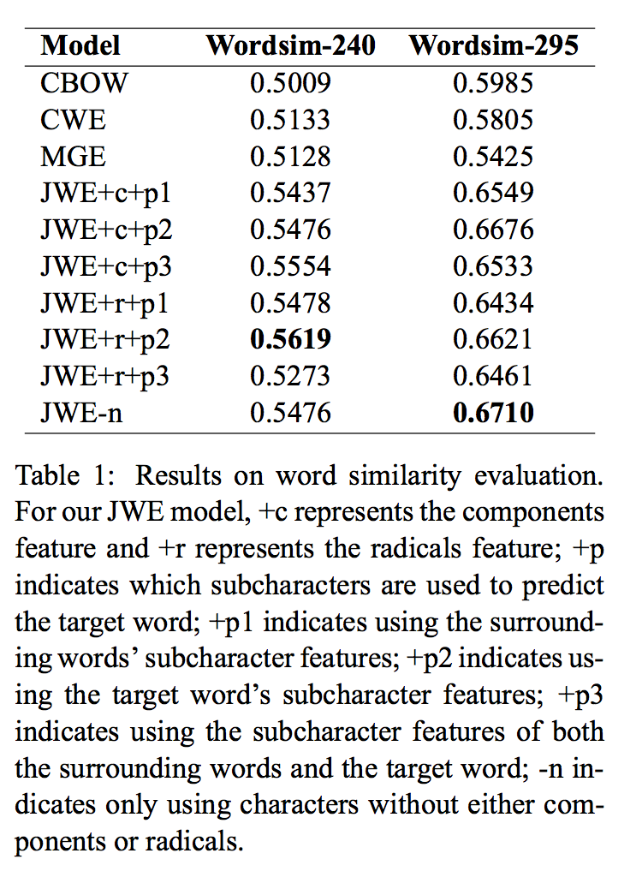

JWE比其他都要好，并且比CWE和MGE好说明，把词／字／组件三者分开去预测比将它们加起来／连接／平均去预测要好。只加字信息(JWE-n)就能够得到很好的效果，可能这两个数据集中字的信息加上去就够了，比如“法律”和“律师”。

## **词analogy**

同样使用CWE的数据集去评测。

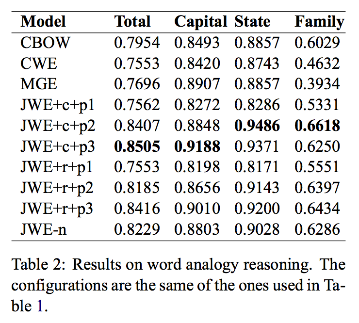

JWE最好，并且JWE加了组件(JWE+c)的最好，说明除了偏旁部首外，加上其他组件效果确实更好。

## **Case Study**

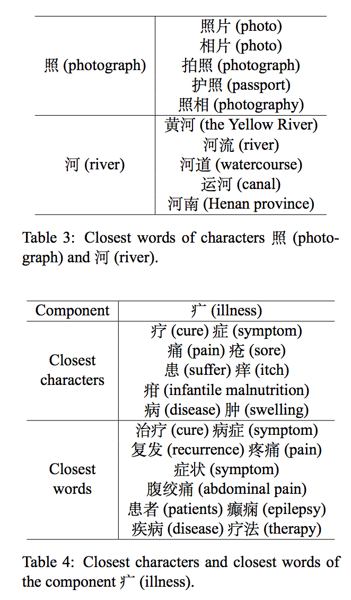

取“照”“河”两个字做例子，可以看出大多数相近的词意思也相近。

取病字头做例子，可以看出相近的字／词都和疾病有关，并且不都是有病字头的比如“患”和“肿”，说明JWE并没有过度使用组件信息，而是同时使用了外部共现信息和内部结构信息。

## **代码链接**

https://github.com/HKUST-KnowComp/JWE

#

# **[How to Generate a Good Word Embedding?](https://arxiv.org/pdf/1507.05523.pdf)**

## **corpus domain is more important than corpus size**

语料越大越好，用领域相关的语料最好，领域相关比语料大小更重要。使用领域相关的语料能提升任务的性能，而用不相关的语料会降低性能。对于某些任务，用纯的相关领域语料比用一个混合领域语料效果要好。同样领域语料，语料越大越好。

## **faster models provide sufficient performance in most cases, and more complex models can be used if the train- ing corpus is sufficiently large**

向量维度一般越大越好，但是一般NLP任务，50就够了

## **early stopping**

迭代次数太少学习不够，迭代次数太多会过拟合。early stopping是个很好的方法，但是传统是在验证集上loss出现peak时停止，这个和任务性能好坏不一致，最好通过开发集上任务性能来决定什么时候停止。对于大多数任务，迭代到出现peak停止能够得到不错的embedding，但是更好的embedding需要根据验证集在相关任务上的性能来判断何时停止。

#

# **[cw2vec: Learning Chinese Word Embeddings with Stroke n-gram Information](http://www.statnlp.org/wp-content/uploads/papers/2018/cw2vec/cw2vec.pdf)**

## **cw2vec模型**

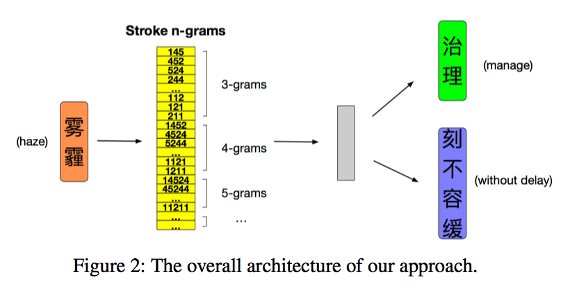

把词先分成$n$-grams，每一个$n$-grams笔画都会有表示向量，上下文字表示为相同维度的词向量，最后再优化一个目标函数得到训练语料上的词向量和$n$-grams笔画笔画向量。

### **$n$-grams笔画**

把笔画分为五类，每一个对应一个整数标签（1-5）如下图：

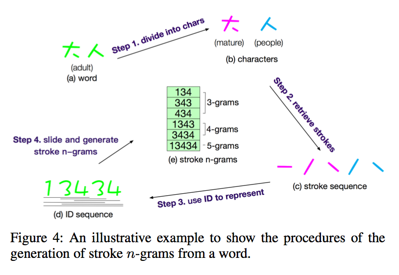

如上图，通过以下步骤把词分为$n$-grams笔画：（1）把词分成字，（2）得到每个字的笔画序列，然后再把他们连接起来，（3）利用笔画ID来标识这些序列，（4）通过一个滑动窗口来生成$n$-grams笔画。$n$-grams笔画中的$n$取3-12。

### **目标函数**

采用Skip-Gram加上negative-sampling，得到以下目标函数

其中

$$
sim(w,c)=\sum_{q\in S(w)}\vec q \cdot \vec c
$$

其中，$S(w)$表示词$w$的$n$-grams笔画集合，$q$是其中的元素，$\vec q$是笔画向量，$\vec c$是词向量。

目标函数的其他地方和word2vec中一样。

优化目标函数后，把上下文词向量作为最终词向量输出。

## **实验设置**

### **数据**

用[中文维基](https://dumps.wikimedia.org/zhwiki/20161120/)作为训练语料，利用[gensim中的脚本](https://radimrehurek.com/gensim/corpora/wikicorpus.html)来处理维基语料，用[opencc](https://github.com/BYVoid/OpenCC)来将语料转成简体中文，unicode落在$0x4E00$到$0x9FA5$间的是中文字保留下来，用[ansj](https://github.com/NLPchina/ansj_seg)来做分词。利用[Juhe Data](https://www.juhe.cn/docs/api/id/156)提供的API得到中文字的笔画信息。

### **Benchmarks和评价方法**

词相似和词analogy用CWE提供的，文本分类用[复旦语料](http://www.datatang.com/data/44139/)作为评价数据。实现《End-to-end sequence labeling via bi-directional lstm-cnns-crf》中的模型，利用[标注好的命名实体语料](http://bosonnlp.com/resources/BosonNLP_NER_6C.zip)来测试命名实体识别的效果，其中只把词向量当作特征输入输入层。取每个词的最近邻词做qualitative分析。

baseline选择word2vec,Glove,CWE,GWE(《Learning chinese word rep- resentations from glyphs of characters》)和JWE，用同样的向量维度，去除词频小于10的，上下文窗口大小和negative sampling都设为5。

## **实验结果**

### **四个任务**

可以看到词相似，词analogy和文本分类，命名实体识别都是cw2vec最好。

### **向量维度的影响**

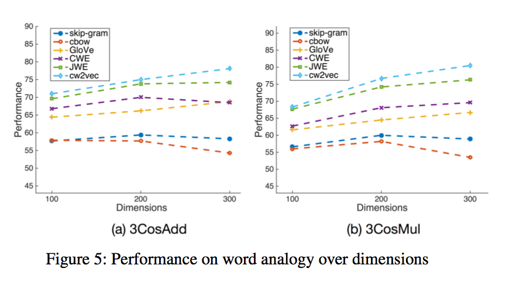

### **语料大小的影响**

取前20%语料去训练，词相似结果如下

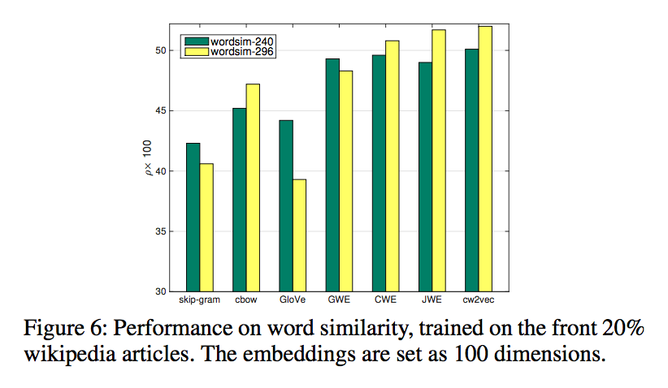

### **Qualitative Results**

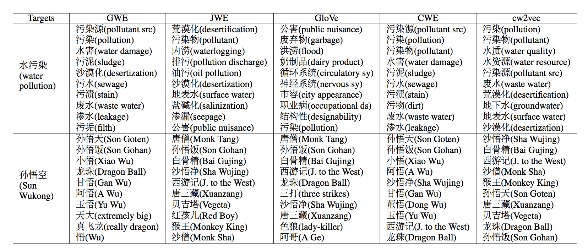

结果如上，cw2vec更加好点。之前的方法CWE,GWE等都会受频繁的字的影响，cw2vec通过使用$n$-grams笔画缓解了这一现象。