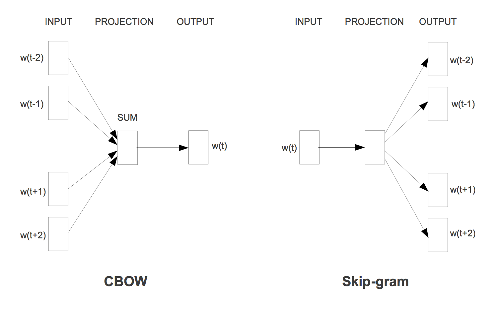
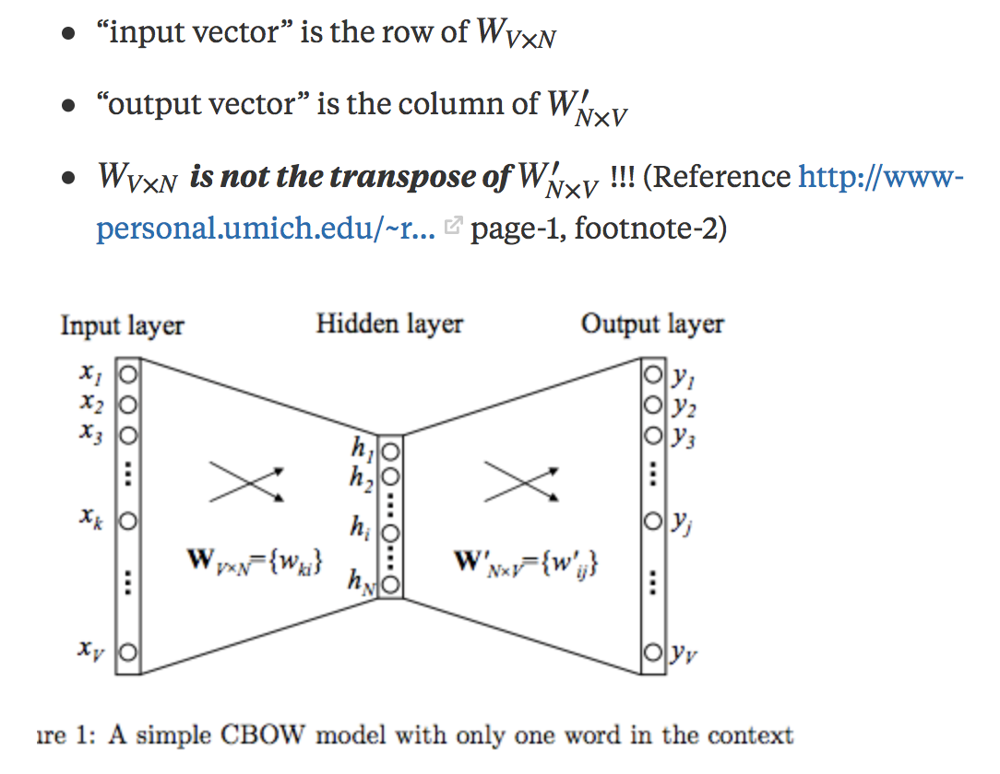
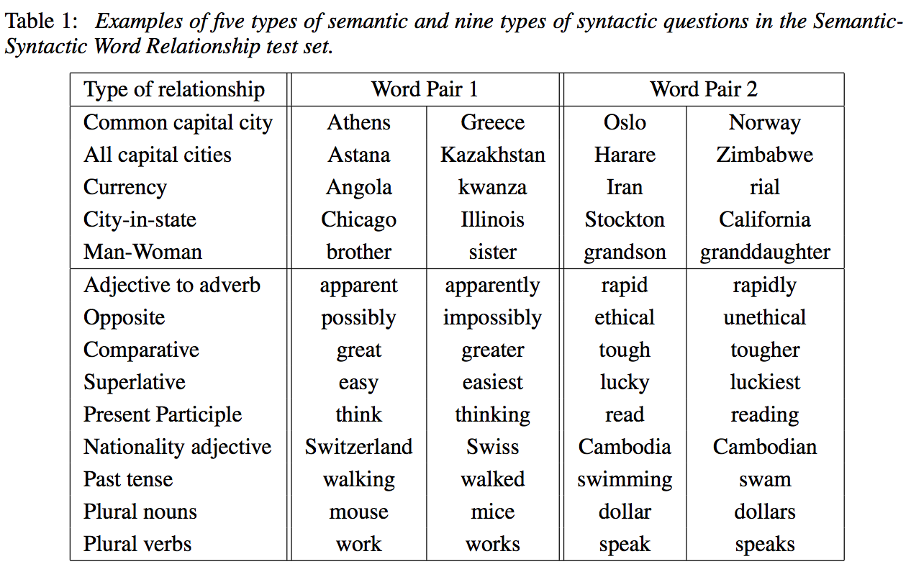

# ***Word2Vec***

## ***CBOW & Skip-gram***
## 

## ***加速／提高精度的方法***
### 给定训练词序列$w_1$, $w_2$, ... , $w_T$,Skip-gram的目标是最大化average log probability:
$$
\frac{1}{T} \sum_{t=1}^{T}{ \sum_{-c\le j\le c,j\ne 0}{\log p(w_{t+j}|w_t)} }
$$ (1)
### $p(w_{t+j}|w_t)$通过softmax函数定义：
$$ 
p(w_O|w_I)=\frac{\exp({v^{'}_{w_O}}^{T}v_{w_I})}{\sum_{w=1}^{W}\exp({v^{'}_{w}}^{T}v_{w_I})}
$$ (2)
### $v_w,v^{'}_w$分别表示$w$的"input"和"output"向量表示,这里"input","output"向量表示具体含义引用quora上的解释:
## 
### 公式(2)的计算代价正比于$W$(字典中的大小)，十分高昂
### ***Hierarchical Softmax***
### https://blog.csdn.net/itplus/article/details/37969979
### ***Negative Sampling***
### https://blog.csdn.net/itplus/article/details/37998797
### ***Subsampling***
### 一般罕见的词比常见的词(例如‘的’)提供更多的信息，并且常见词在大量训练后其含义也不应该发生剧烈变化，因此对于训练集中的每个词以如下概率进行舍弃：
$$
P(w_i) = 1 - \sqrt{\frac{t}{f(w_i)}}
$$ (3)
### $f(w_i)$指$w_i$的词频,$t$是阈值，一般在$10^{-5}$

## ***学习短语表达***
### 很多短语的意思并不是简单词意思的组合，为了学习短语的向量表达，首先找出词频繁共同出现的词，并且在其他上下文中不频繁出现，比如"New York Times"被当作是一个独立的token，而"this is"则不被看作是一个token。
### 通过一种简单的data-driven的方法来识别短语，短语是基于unigram和bigram计数的，使用如下公式：
$$
score(w_i, w_j)=\frac{count(w_iw_j)-\delta}{count(w_i)\times count(w_j)}
$$ (4)
### $\delta$参数是用来防治产生过多由极罕见词构成的短语。score超过某个阈值的短语将被提取出来作为token。一般我们对整个训练集进行2-4次计算得分操作，并且阈值逐渐减小，使得产生更长的短语。

## ***评价方法***
### ***词相似***
### "France"和"Italy", "red"和"green"等
### ***syntactic, semantic相似***
## 
### ***加法组合***
## 比如 "Russia" + "river" = "Volga River", "Germany" + "capital" = "Berlin"

## ***实验结果***
### 实验在一个a comprehensive test set上进行，包括上图中5个semantic问题和9个syntactic问题，然后只有完全匹配对才算正确（同义词也算错），因此几乎不可能100%准确略。
### 必须要同时增大词向量维度和训练集带下才能提升效果
### Skip-gram要好于CBOW
### 一般只要一个epoch即可，在两倍大小的训练集上一个epoch结果比和在原始大小训练集上3个epoch的结果差不多甚至更好，并且一个epoch时间更短。
### negtive sample 在k=5时效果就很好, k=15时效果更好。用Hierarchical Softmax在没有subsample时效果比较差，但是加上subsample后效果最好。可以看出subsample不仅能够更快，精度也更高。
## 
### 为了最大化精度，用33 billion词的语料，使用Hierarchical Softmax，词向量维度1000用整个句子作为上下文窗口，能够达到72%的准确略，当只用6B词的语料时，准确度下降到66%，因此大语料至关重要。

## ***word2vec源码细节***
### https://blog.csdn.net/itplus/article/details/37999613

## ***参考文献***
### [1] Efficient Estimation of Word Representations in Vector Space
### [2] Distributed Representations of Words and Phrases and their Compositionality
### [3] https://blog.csdn.net/itplus/article/details/37969519