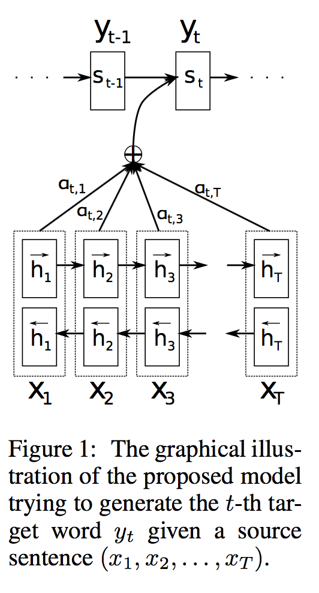
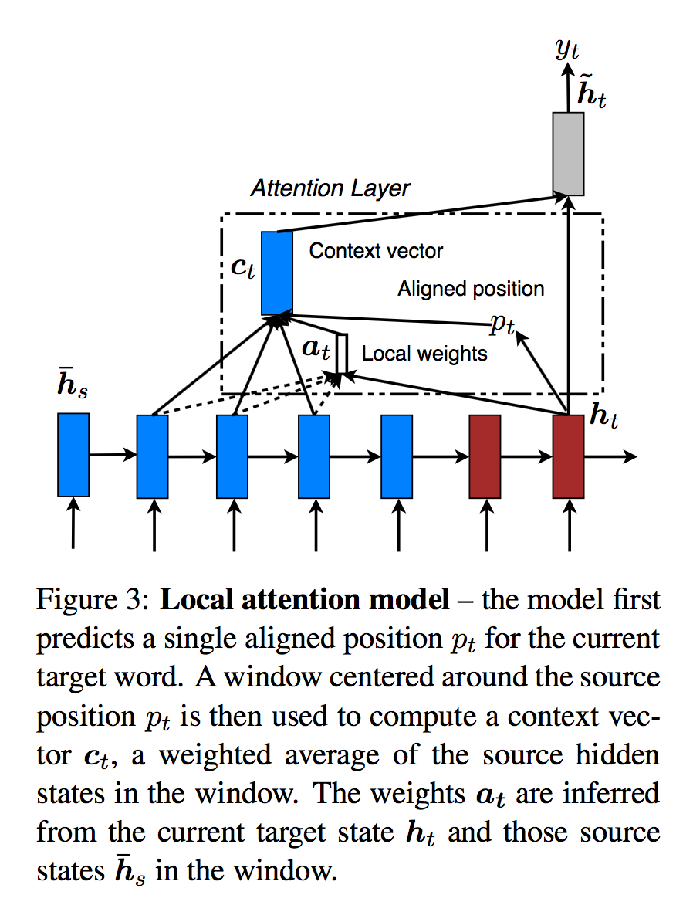
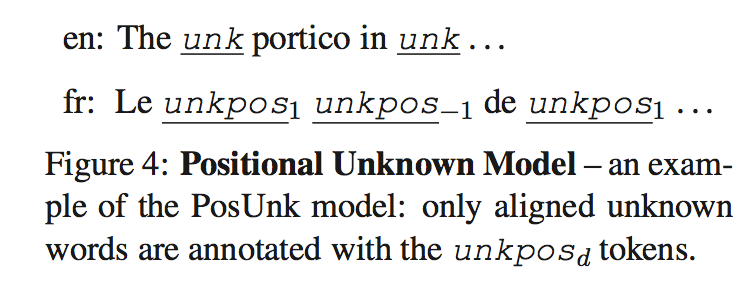

# **近年机器翻译论文笔记**

## **[Sequence to Sequence Learning with Neural Networks](https://arxiv.org/pdf/1409.3215.pdf)**

序列学习的开山之作，也是神经机器翻译的基本模型。

基本策略是把输入序列通过RNN映射到一个固定长度的向量，然后用另一个RNN从这个固定长度的向量中解码出目标序列，一般称前一个RNN为编码器，后一个RNN为解码器。由于基础RNN很难学习长期的依赖，所以一般采用LSTM。

Seq2Seq模型的训练目标是预测条件概率$p(y_1,...,y_{T'}|x_1,...,x_T)$，其中$x_1,...,x_T$是输入序列，$y_1,...,y_{T'}$是输出序列，其中两个序列的长度$T$和$T'$不同。LSTM需要首先计算输入序列的固定维度的表示$v$，这里用LSTM最后一个隐层状态表示$v$，然后通过另一个LSTM来计算输出序列的概率，其中这个LSTM初始隐层状态设为$v$，公式如下：

$$
p(y_1,...,y_{T'}|x_1,...,x_T)=\prod_{t=1}^{T'}p(y_t|v,y1,...,y_{t-1})
$$ (1)

其中序列中每一个元素的概率用在整个词表上的softmax表示。另外，我们需要设置每个序列以特殊符号“\<EOS>”结尾，这样使得模型可以处理任意长度的序列。整个模型架构如下图所示：

实际使用的模型有三个注意点：1. 编码器和解码器使用不同的LSTM，这不仅能够增强模型的能力，而且可以同时训练多个语言对。2. 深层LSTM效果比浅层LSTM好，论文中采用了4层LSTM。3. 作者发现将输入序列逆向后在输入模型十分重要。比如$a,b,c$不是对应于$\alpha, \beta, \gamma$，而是要求模型将$c,b,a$映射到$\alpha, \beta, \gamma$，其中$\alpha, \beta, \gamma$是$a, b, c$的翻译。这样的好处是，使得$a$和$\alpha$，$b$和$\beta$更加接近，使得更容易在输入序列和输出序列中建立联系。作者发现这个简单的操作能够大大提升效果。

## **[NEURAL MACHINE TRANSLATION BY JOINTLY LEARNING TO ALIGN AND TRANSLATE](https://arxiv.org/pdf/1409.0473.pdf)**

作者提出基本编码器-解码器的神经机器翻译架构将输入序列编码成一个固定长度的向量这一做法，是效果提升的瓶颈所在，因此提出让模型自己软搜索和下一个目标词相关的输入序列中的词，而不是硬性的进行词对齐。这其实就是attention注意力模型在机器翻译上的应用，并且作者展示了模型学到的软对齐符合人类常识。

模型整体采用了双向RNN作为编码器，解码器在解码时需要同时搜索输入序列进行软对齐。

首先介绍解码器的通用架构。定义条件概率如下：

$$
p(y_i|y_1,...,y_{i-1},\bold x)=g(y_{i-1}, s_i, c_i)
$$ (1)

其中$s_i$是$i$时刻RNN的隐层状态，计算如下：

$$
s_i=f(s_{i-1}, y_{i-1}, c_i)
$$ (2)

和传统目标序列条件概率不同，目标词$y_i$依赖一个称之为上下文向量的$c_i$。上下文向量$c_i$又依赖annotation序列$(h_1,...,h_{T_x})$，这个annotations序列序列由编码器映射输入序列得到，其中每个annotation$h_i$包含整个输入序列的信息，尤其关注输入序列中第$i$个词周围的信息，annotation的生成在下面介绍。上下文向量$c_i$由annotations的加权求和得到：

$$
c_i = \sum_{j=1}^{T_x}\alpha_{ij}h_j
$$ (3)

其中每个annotation的权重计算如下：

$$
\alpha_{ij}=\frac{\exp(e_{ij})}{\sum_{k=1}^{T_x}\exp(e_{ik})}
$$ (4)

其中

$$
e_{ij} = a(s_{i-1}, h_j)
$$ (5)

$e_{ij}$称为对齐模型，评价输出序列中第$i$个词和输入序列中第$j$个词有多匹配。通常对齐模型$a$使用一个前馈神经网络，和模型的其他部分一起参与训练。

$\alpha_{ij}$或者$e_{ij}$表示了annotation$h_i$对于前一个隐层状态$s_{i-1}$决定当前隐层状态$s_i$和输出$y_i$的重要性。直观地，这实现了一个带有注意力的解码器，解码器能够决定需要注意什么。通过注意力机制，编码器不需要将输入序列的所有信息包含到一个长度固定的向量中，输入序列的信息分散到annotation序列中，解码器可以自己选择要使用哪些信息去解码。

下面介绍编码器的通用架构。传统编码器只能够按顺序进行编码，而annotation不仅需要包含之前的信息，也需要包含之后的信息，因此使用双向RNN来做编码。双向RNN中前向RNN按照正常顺序读入输入序列，得到前向隐层状态$(\overrightarrow{h_1},...,\overrightarrow{h_{T_x}})$，后向RNN按照逆序读入输入序列，得到后向隐层状态$(\overleftarrow{h_1},...,\overleftarrow{h_{T_x}})$，最后将前向隐层状态和后向隐层状态连接起来得到词的annotation，$h_j=[\overrightarrow{h_j}^T;\overleftarrow{h_j}^T]^T$，这样annotation $h_j$同时包含当前词之前和之后的信息，并且由于RNN更倾向于表示最近的信息，annotation $h_j$也会更加关注周围词的信息。

整体架构如下图所示：

## **[Effective Approaches to Attention-based Neural Machine Translation](https://arxiv.org/pdf/1508.04025.pdf)**

由于还没有基于注意力的神经机器翻译模型，作者提出两个简单有效的注意力机制：全局注意力，总是考虑输入序列中的所有词；局部注意力，只考虑输入序列中的一部分词。分别如下两图所示：

这两种模型的共同之处如下，首先都是把解码器stacking LSTM的顶层隐层状态$\bold{h_t}$作为输入，目标是推出上下文向量$\bold{c_t}$，能够捕捉相关源端的信息，用来预测当前的目标词$y_t$。上下文向量$\bold{c_t}$的推导两种方法不一样，之后再介绍。在得到$\bold{c_t}$后，将其和$\bold{h_t}$连接起来得到带有注意力的隐层状态$\tilde{\bold{h_t}}$：

$$
\tilde{\bold{h_t}}=\tanh(\bold{W_c}[\bold{c_t};\bold{h_t}])
$$ (1)

然后$\tilde{\bold{h_t}}$被输入softmax层来预测下一个目标词：

$$
p(y_t|y_{\lt{t}},x)=softmax(\bold{W_s}\tilde{\bold{h_t}})
$$ (2)

下面介绍全局注意力模型。一个和输入序列一样长的对齐向量$\bold{a_t}$用来比较当前目标隐层状态$\bold{h_t}$和所有源隐层状态$\bar{\bold{h_s}}$：

$$
\bold{a_t}(s)=align(\bold{h_t},\bar{\bold{h_s}})=\frac{\exp(score(\bold{h_t},\bar{\bold{h_s}}))}{\sum_{s'}\exp(score(\bold{h_t},\bar{\bold{h_{s'}}}))}
$$ (3)

这里的$score$被称为基于内容的函数，作者提出三种函数：

$$
score(\bold{h_t},\bar{\bold{h_s}})=\begin{cases}
\bold{h_t}^T\bar{\bold{h_s}}, & dot \\
\bold{h_t}^T\bold{W_a}\bar{\bold{h_s}}, & general \\
\bold{v_a}^T\tanh(\bold{W_a}[\bold{h_t};\bar{\bold{h_s}}]), & concat
\end{cases}
$$ (4)

除此之外，作者还提出一种基于位置的函数，只使用目标隐层状态来计算$\bold{a_t}$：

$$
\bold{a_t}=softmax(\bold{W_a}\bold{h_t})
$$ (5)

这种方法所有对齐向量$\bold{a_t}$一样长，对于短的输入句子，只使用$\bold{a_t}$前面的部分，对于长的输入句子，忽视句子的末尾部分。

之后将对齐向量作为权重，上下文向量$\bold{c_t}$是所有源隐层向量的加权平均。

下面介绍局部注意力模型。全局注意力模型需要注意输入句子中的所有词，这使得计算代价太大，并且实际中无法翻译长句子，因此提出局部注意力模型，只关注输入序列的一部分词。对于时刻$t$的目标词，首先生成一个对齐位置$p_t$，之后上下文向量$\bold{c_t}$是一个窗口内源隐层状态的加权平均，这个窗口为$[p_t-D,p_t+D]$，$D$是根据经验选择的。不同于全局注意力模型，此时局部对齐向量$\bold{a_t}$是固定长度的($\in R^{2D+1}$)，下面介绍该模型的两个变种：

单调对齐。简单设置$p_t=t$,假设目标词和源词是近似单调对齐的，这时对齐向量$\bold{a_t}$如公式(3)定义。

预测对齐。通过模型预测对齐位置：

$$
p_t=S \cdot sigmoid(\bold{v_p}^T\tanh(\bold{W_p}\bold{h_t}))
$$ (6)

其中$\bold{W_p},\bold{v_p}$是模型参数，$S$是输入序列长度，$sigmoid$函数导致$p_t\in[0,S]$。为了突出在$p_t$周围对齐，以中心在$p_t$的高斯分布进行采样，此时的对齐向量定义如下：

$$
\bold{a_t}(s)=align(\bold{h_t},\bar{\bold{h_s}})\exp(-\frac{(s-p_t)^2}{2\sigma^2})
$$ (7)

使用公式(3)描述的$align$函数，并且标准差设为$\sigma=\frac{D}{2}$，其中$p_t$是一个实数，$s$是以$p_t$为中心的窗口内的整数。

上面提到的全局注意力和局部注意力都是独立计算的，也是次优的，标准的翻译模型里需要维护一个覆盖率来追踪哪些输入句子里的词已经被翻译过了，因此神经翻译模型里也应该考虑之前的对齐信息。作者因此又提出input-feeding方法，将注意力向量$\tilde{\bold{h_t}}$和下一时刻的输入连接起来一起作为输入，如下图所示：

这样有两个好处：1. 可以考虑之前的对齐信息；2. 创造了一个水平垂直方向上更深的网络结构。

[代码和资料地址](https://nlp.stanford.edu/projects/nmt/)

## **[On Using Very Large Target Vocabulary for Neural Machine Translation](https://arxiv.org/pdf/1412.2007.pdf)**

神经机器翻译模型在处理大词表时，训练和解码复杂度都会急剧增加。作者提出基于importance sampling的方法，能够在不增加训练复杂度的情况下使用大词表，解码也可以仅使用大词表的一部分来提高效率。

计算下一个目标词softmax概率如下：

$$
p(y_t|y_{\lt t},x)=\frac{1}{Z}\exp(\bold{w_t}^T\phi (y_{t-1},z_t,c_t)+b_t)
$$ (1)

首先考虑公式(1)对数概率的梯度，包括正项和负项两部分：

$$
\nabla \log p(y_t|y_{\lt t},x)=\nabla \varepsilon(y_t)-\sum_{k:y_t\in V}p(y_k|y_{\lt t}, x)\nabla (y_k)
$$ (2)

其中能量$\varepsilon$定义为：

$$
\varepsilon (y_j)=\bold{w_j}^T\phi (y_{j-1},z_j,c_j)+b_j
$$ (3)

梯度的第二项（负项）就是能量的期望梯度：

$$
E_P[\nabla \varepsilon(y)]
$$ (4)

其中$P$表示$p(y|y_{\lt t}, x)$。

主要策略是通过importance sampling，用小部分采样去估计这个期望（梯度的负项）。给定一个分布$Q$和$Q$中的一组样本$V'$，预测公式(4)如下：

$$
E_P[\nabla \varepsilon(y)]\approx \sum_{k:y_k\in V'}\frac{w_k}{\sum_{k':y_{k'}\in V'}}\nabla \varepsilon(y_k)
$$ (5)

其中

$$
w_k=\exp(\varepsilon(y_k)-\log Q(y_k))
$$ (6)

这个方法能够在训练过程中只用大词表的一小部分去计算归一化项，从而大大降低参数更新的计算复杂度。

尽管这个方法大大降低计算复杂度，但是直接使用这个方法并不能保证每次更新的包含多个目标词的句子对所使用的参数数量是可控的，这在使用GPU这样的小内存设备时尤为麻烦。因此，实际中将训练语料分成若干份，每一份在训练前定义大词表的一个子集$V'$。在训练开始前，我们顺序的检查训练语料中的每一个目标句子，然后累计唯一目标词直到达到数量预定的阈值$\tau$。这个累计的词表就会用作这部分训练语料的词表，重复这个过程直到训练集结束。定义第$i$部分训练语料的词表为$V_i'$。

对于每一部分语料有一个预知的分布$Q_i$，$Q_i$对于$V_i'$中每一个词的概率相同，其他词的概率为0:

$$
Q_i(y_k)=\begin{cases}
\frac{1}{|V_i'|}, & if\ y_t\in V_i' \\
0, & otherwise
\end{cases}
$$ (7)

这个分布把公式(5)(6)中的修正项给去掉$-\log Q(y_k)$，使得提出的方法能够正确估计公式(1)的概率为：

$$
p(y_t|y_{\lt t},x)=\frac{\exp(\bold{w_t}^T\phi (y_{t-1},z_t,c_t)+b_t)}{\sum_{k:y_k\in V'}\exp(\bold{w_k}^T\phi(y_{t-1},z_t,c_t)+b_t)}
$$ (8)

值得注意的是使用的分布$Q$使得估计有偏差。

模型训练好后，可以用完整词表去解码，这样更加准确，但也更慢。因此解码时我们也可以只用词表的一小部分，但和训练时候的区别是，此时并不能直接吧把正确的目标词作为词表。最简单的做法是选取最常见的$K$个词，但是这样就不符合用大词表去训练模型的本意了。因此，可以使用现有的词对齐模型在训练语料上去对齐源词和目标词，然后建立字典。有了这个字典后，对于每一个输入句子，把最常见的$K$个词和字典中每个源词对应的$K'$个目标词构成目标词集合。$K$和$K'$的选择根据内存限制和效果要求，称构建出来的这个目标词集合为候选集。

[代码地址](https://github.com/sebastien-j/LV_groundhog)

## [Addressing the Rare Word Problem in Neural Machine Translation](https://arxiv.org/pdf/1410.8206.pdf)

神经机器翻译一个很大的缺点是不能够处理罕见词，一般只有一个很小的词表，并且用一个unk符号表示所有不在字典中的词。作者提出一个有效的方法解决这个问题，训练模型时同时输出词对齐结果，使得系统在目标句子中遇到OOV时能够定位源句子中与其对齐的词，这个信息在之后的后处理过程中用来根据字典翻译目标句子中的OOV。

作者提出在训练模型时能够追踪目标句子里的OOV在源句子中的位置，从而解决罕见词问题。如果知道了目标句子中OOV在源句子里对齐的词，可以在后处理时，把unk换成源句子中对应词的翻译或者这个词本身。

作者提出三种策略，能应用到任何机器翻译模型中。首先一个无监督的对齐器用来做对齐，然后利用这个对齐信息构建字典，用来在后处理过程中进行翻译。如果一个词没有出现在字典中，那么就把这个词直接拷贝到目标句子中。

首先介绍拷贝模型。这个方法使用多个unk符号来表示源语言和目标语言中的罕见词，而不是只用一个unk符号。把源句子中的OOV分别注释为unk1,unk2,unk3...相同的OOV被赋予相同的unk符号。目标句子中的OOV注释方法如下：目标语言中的OOV和源语言中的OOV对齐时，赋予源语言中OOV的unk符号（所以被称为拷贝模型），如果目标语言中OOV和源语言不对齐活着和不是OOV的词对齐，那么源语言中的OOV被赋予特殊的$unk_{\emptyset}$。如下图：

下面介绍PosAll模型。拷贝模型不能够处理目标语言中OOV和源语言中已知词对齐的情况，而这种情况会频繁出现在源语言词表大于目标语言词表时。这就需要能够建立源句子和目标句子间的完全对齐关系。

具体的，只使用一个unk符号，但是在目标语言端，需要在每一个词后面插入一个位置符号$p_d$，这里$d$表示相对位置关系$(d=-7,...,-1,0,1,...,7)$，表示目标语言中位置$j$处的词和源语言中位置$i=j-d$的词对齐，距离太远的对齐词被认为是不对齐的，这些词被注释为特殊null符号$p_n$。如下图：

最后介绍PosUnk模型。PosAll模型的缺点在于它使得输入序列的长度加倍了，这使得学习更加困难，也更慢。由于我们的后处理只关心OOV词，所以可以只注释OOV词。PosUnk模型使用$unkpos_d(d=-7,...7)$来标注OOV词，并且$d$表示和对齐词的相对位置关系，同样使用$unkpos_{\emptyset}$表示不对齐的OOV，用unk注释源句子中的所有OOV。如下图：

## **[Improving Neural Machine Translation Models with Monolingual Data](https://arxiv.org/pdf/1511.06709.pdf)**

神经机器翻译传统只使用双语语料，但是目标端的单语语料在传统统计翻译模型中能够提升翻译流畅度，作者探究如何在神经机器翻译中使用单语语料。之前的做法是将神经机器翻译模型和语言模型的结合起来，但是作者发现目前编码起啊解码器模型完全可以学到和语言模型一样的信息，并且不需要改变目前的模型架构。通过自动的后向翻译，可以将单语语料构建出一个合成的双语语料。

作者提出两种策略：1. 将目标单语语料和源语言的空句子组合成双语语料。2. 通过将目标单语语料翻译成源语言后，组成双语语料，这种方法作者称为后向翻译(back-translation)。

首先介绍用空句子构成双语语料。这种方法将目标语言的单语语料和源语言的空句子组合构成合成的双语语料，这样上下文向量$c_i$就不包含任何信息，模型完全通过前一个目标词预测当前目标词。这个方法和dropout的思想很像，也可以当作是一种多任务学习模型，当源句子知道时就是翻译任务，当源句子不知道时就是语言模型任务。

训练时把双语语料和单语语料1比1结合起来，并且随机打乱。当处理单语语料时把源句子设为单个\<null>词语，这样就可以用同一个模型同时训练单语语料和双语语料，当处理单语语料时，固定住编码器和注意力模型的参数。但存在一个问题，不能任意增加单语语料的比例，如果单语语料太大，网络将很难学习。

下面介绍后向翻译构成双语语料。用一个训练好的目标到源的机器翻译模型去翻译目标端的单语语料，然后得到的源语言句子和目标端单语语料一起构成合成的双语语料。这样在训练时将双语语料和合成双语语料混合起来，并且不作区分，参数也不需要固定。
