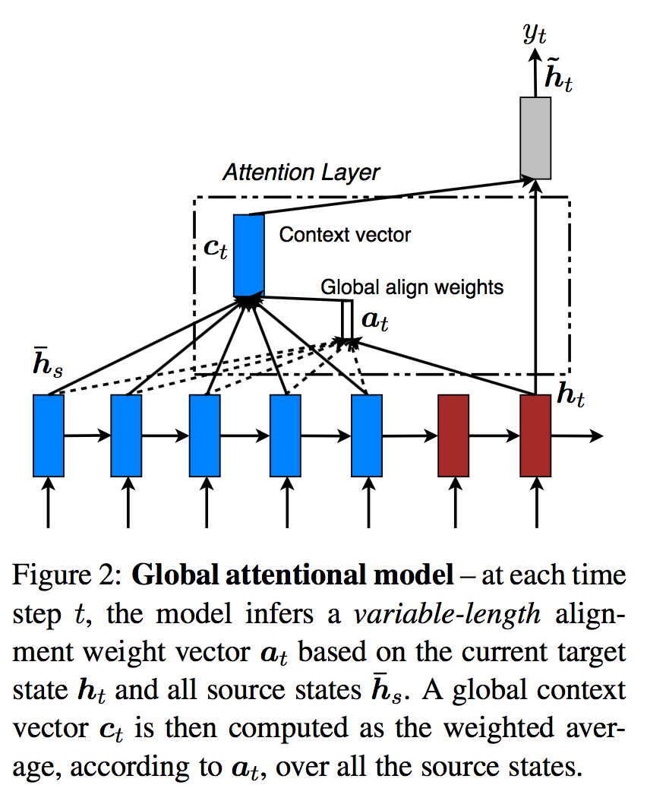

# **近年机器翻译论文笔记**

## **[Sequence to Sequence Learning with Neural Networks](https://arxiv.org/pdf/1409.3215.pdf)**

序列学习的开山之作，也是神经机器翻译的基本模型。

基本策略是把输入序列通过RNN映射到一个固定长度的向量，然后用另一个RNN从这个固定长度的向量中解码出目标序列，一般称前一个RNN为编码器，后一个RNN为解码器。由于基础RNN很难学习长期的依赖，所以一般采用LSTM。

Seq2Seq模型的训练目标是预测条件概率$p(y_1,...,y_{T'}|x_1,...,x_T)$，其中$x_1,...,x_T$是输入序列，$y_1,...,y_{T'}$是输出序列，其中两个序列的长度$T$和$T'$不同。LSTM需要首先计算输入序列的固定维度的表示$v$，这里用LSTM最后一个隐层状态表示$v$，然后通过另一个LSTM来计算输出序列的概率，其中这个LSTM初始隐层状态设为$v$，公式如下：

$$
p(y_1,...,y_{T'}|x_1,...,x_T)=\prod_{t=1}^{T'}p(y_t|v,y1,...,y_{t-1})
$$ (1)

其中序列中每一个元素的概率用在整个词表上的softmax表示。另外，我们需要设置每个序列以特殊符号“\<EOS>”结尾，这样使得模型可以处理任意长度的序列。整个模型架构如下图所示：

实际使用的模型有三个注意点：1. 编码器和解码器使用不同的LSTM，这不仅能够增强模型的能力，而且可以同时训练多个语言对。2. 深层LSTM效果比浅层LSTM好，论文中采用了4层LSTM。3. 作者发现将输入序列逆向后在输入模型十分重要。比如$a,b,c$不是对应于$\alpha, \beta, \gamma$，而是要求模型将$c,b,a$映射到$\alpha, \beta, \gamma$，其中$\alpha, \beta, \gamma$是$a, b, c$的翻译。这样的好处是，使得$a$和$\alpha$，$b$和$\beta$更加接近，使得更容易在输入序列和输出序列中建立联系。作者发现这个简单的操作能够大大提升效果。

## **[NEURAL MACHINE TRANSLATION BY JOINTLY LEARNING TO ALIGN AND TRANSLATE](https://arxiv.org/pdf/1409.0473.pdf)**

作者提出基本编码器-解码器的神经机器翻译架构将输入序列编码成一个固定长度的向量这一做法，是效果提升的瓶颈所在，因此提出让模型自己软搜索和下一个目标词相关的输入序列中的词，而不是硬性的进行词对齐。这其实就是attention注意力模型在机器翻译上的应用，并且作者展示了模型学到的软对齐符合人类常识。

模型整体采用了双向RNN作为编码器，解码器在解码时需要同时搜索输入序列进行软对齐。

首先介绍解码器的通用架构。定义条件概率如下：

$$
p(y_i|y_1,...,y_{i-1},\bold x)=g(y_{i-1}, s_i, c_i)
$$ (1)

其中$s_i$是$i$时刻RNN的隐层状态，计算如下：

$$
s_i=f(s_{i-1}, y_{i-1}, c_i)
$$ (2)

和传统目标序列条件概率不同，目标词$y_i$依赖一个称之为上下文向量的$c_i$。上下文向量$c_i$又依赖annotation序列$(h_1,...,h_{T_x})$，这个annotations序列序列由编码器映射输入序列得到，其中每个annotation$h_i$包含整个输入序列的信息，尤其关注输入序列中第$i$个词周围的信息，annotation的生成在下面介绍。上下文向量$c_i$由annotations的加权求和得到：

$$
c_i = \sum_{j=1}^{T_x}\alpha_{ij}h_j
$$ (3)

其中每个annotation的权重计算如下：

$$
\alpha_{ij}=\frac{\exp(e_{ij})}{\sum_{k=1}^{T_x}\exp(e_{ik})}
$$ (4)

其中

$$
e_{ij} = a(s_{i-1}, h_j)
$$ (5)

$e_{ij}$称为对齐模型，评价输出序列中第$i$个词和输入序列中第$j$个词有多匹配。通常对齐模型$a$使用一个前馈神经网络，和模型的其他部分一起参与训练。

$\alpha_{ij}$或者$e_{ij}$表示了annotation$h_i$对于前一个隐层状态$s_{i-1}$决定当前隐层状态$s_i$和输出$y_i$的重要性。直观地，这实现了一个带有注意力的解码器，解码器能够决定需要注意什么。通过注意力机制，编码器不需要将输入序列的所有信息包含到一个长度固定的向量中，输入序列的信息分散到annotation序列中，解码器可以自己选择要使用哪些信息去解码。

下面介绍编码器的通用架构。传统编码器只能够按顺序进行编码，而annotation不仅需要包含之前的信息，也需要包含之后的信息，因此使用双向RNN来做编码。双向RNN中前向RNN按照正常顺序读入输入序列，得到前向隐层状态$(\overrightarrow{h_1},...,\overrightarrow{h_{T_x}})$，后向RNN按照逆序读入输入序列，得到后向隐层状态$(\overleftarrow{h_1},...,\overleftarrow{h_{T_x}})$，最后将前向隐层状态和后向隐层状态连接起来得到词的annotation，$h_j=[\overrightarrow{h_j}^T;\overleftarrow{h_j}^T]^T$，这样annotation $h_j$同时包含当前词之前和之后的信息，并且由于RNN更倾向于表示最近的信息，annotation $h_j$也会更加关注周围词的信息。

整体架构如下图所示：

## **[Effective Approaches to Attention-based Neural Machine Translation](https://arxiv.org/pdf/1508.04025.pdf)**

由于还没有基于注意力的神经机器翻译模型，作者提出两个简单有效的注意力机制：全局注意力，总是考虑输入序列中的所有词；局部注意力，只考虑输入序列中的一部分词。分别如下两图所示：

这两种模型的共同之处如下，首先都是把解码器stacking LSTM的顶层隐层状态$\bold{h_t}$作为输入，目标是推出上下文向量$\bold{c_t}$，能够捕捉相关源端的信息，用来预测当前的目标词$y_t$。上下文向量$\bold{c_t}$的推导两种方法不一样，之后再介绍。在得到$\bold{c_t}$后，将其和$\bold{h_t}$连接起来得到带有注意力的隐层状态$\tilde{\bold{h_t}}$：

$$
\tilde{\bold{h_t}}=\tanh(\bold{W_c}[\bold{c_t};\bold{h_t}])
$$ (1)

然后$\tilde{\bold{h_t}}$被输入softmax层来预测下一个目标词：

$$
p(y_t|y_{\lt{t}},x)=softmax(\bold{W_s}\tilde{\bold{h_t}})
$$ (2)

下面介绍全局注意力模型。一个和输入序列一样长的对齐向量$\bold{a_t}$用来比较当前目标隐层状态$\bold{h_t}$和所有源隐层状态$\bar{\bold{h_s}}$：

$$
\bold{a_t}(s)=align(\bold{h_t},\bar{\bold{h_s}})=\frac{\exp(score(\bold{h_t},\bar{\bold{h_s}}))}{\sum_{s'}\exp(score(\bold{h_t},\bar{\bold{h_{s'}}}))}
$$ (3)

这里的$score$被称为基于内容的函数，作者提出三种函数：

$$
score(\bold{h_t},\bar{\bold{h_s}})=\begin{cases}
\bold{h_t}^T\bar{\bold{h_s}}, & dot \\
\bold{h_t}^T\bold{W_a}\bar{\bold{h_s}}, & general \\
\bold{v_a}^T\tanh(\bold{W_a}[\bold{h_t};\bar{\bold{h_s}}]), & concat
\end{cases}
$$ (4)

除此之外，作者还提出一种基于位置的函数，只使用目标隐层状态来计算$\bold{a_t}$：

$$
\bold{a_t}=softmax(\bold{W_a}\bold{h_t})
$$ (5)

这种方法所有对齐向量$\bold{a_t}$一样长，对于短的输入句子，只使用$\bold{a_t}$前面的部分，对于长的输入句子，忽视句子的末尾部分。

之后将对齐向量作为权重，上下文向量$\bold{c_t}$是所有源隐层向量的加权平均。

下面介绍局部注意力模型。全局注意力模型需要注意输入句子中的所有词，这使得计算代价太大，并且实际中无法翻译长句子，因此提出局部注意力模型，只关注输入序列的一部分词。对于时刻$t$的目标词，首先生成一个对齐位置$p_t$，之后上下文向量$\bold{c_t}$是一个窗口内源隐层状态的加权平均，这个窗口为$[p_t-D,p_t+D]$，$D$是根据经验选择的。不同于全局注意力模型，此时局部对齐向量$\bold{a_t}$是固定长度的($\in R^{2D+1}$)，下面介绍该模型的两个变种：

单调对齐。简单设置$p_t=t$,假设目标词和源词是近似单调对齐的，这时对齐向量$\bold{a_t}$如公式(3)定义。

预测对齐。通过模型预测对齐位置：

$$
p_t=S \cdot sigmoid(\bold{v_p}^T\tanh(\bold{W_p}\bold{h_t}))
$$ (6)

其中$\bold{W_p},\bold{v_p}$是模型参数，$S$是输入序列长度，$sigmoid$函数导致$p_t\in[0,S]$。为了突出在$p_t$周围对齐，以中心在$p_t$的高斯分布进行采样，此时的对齐向量定义如下：

$$
\bold{a_t}(s)=align(\bold{h_t},\bar{\bold{h_s}})\exp(-\frac{(s-p_t)^2}{2\sigma^2})
$$ (7)

使用公式(3)描述的$align$函数，并且标准差设为$\sigma=\frac{D}{2}$，其中$p_t$是一个实数，$s$是以$p_t$为中心的窗口内的整数。

上面提到的全局注意力和局部注意力都是独立计算的，也是次优的，标准的翻译模型里需要维护一个覆盖率来追踪哪些输入句子里的词已经被翻译过了，因此神经翻译模型里也应该考虑之前的对齐信息。作者因此又提出input-feeding方法，将注意力向量$\tilde{\bold{h_t}}$和下一时刻的输入连接起来一起作为输入，如下图所示：

这样有两个好处：1. 可以考虑之前的对齐信息；2. 创造了一个水平垂直方向上更深的网络结构。

[代码和资料地址](https://nlp.stanford.edu/projects/nmt/)
